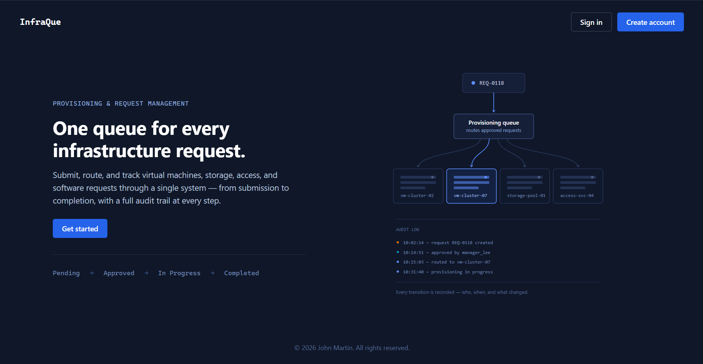
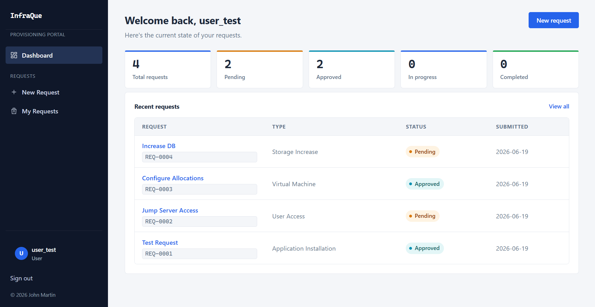
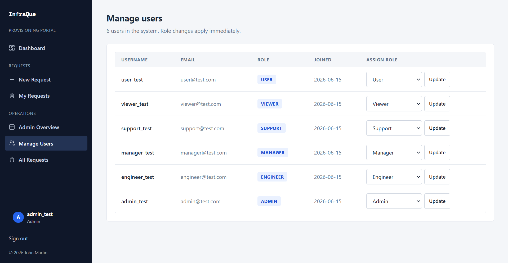

# InfraQue — Infrastructure Provisioning Request Portal

A Flask-based infrastructure request system that simulates a real-world internal tool where employees submit infrastructure requests — new servers, storage increases, system access, software installs — and a chain of people review, approve, and carry out the work. A request moves through a clear lifecycle: submitted, approved or rejected, worked on, completed. Every step is tracked and logged automatically, so the full history of who did what and when is always available.



## The problem

Most companies still handle IT requests the same messy way: an email here, a chat message there, a spreadsheet that never gets updated. A request gets approved by someone, but the person who actually needs to do the work never finds out. Nobody can say for sure what was asked for, who said yes to it, or where it stands right now. Once a request leaves its original message or email, it's basically gone.

## The solution

InfraQue puts every request in one place and gives it a clear path: submitted, approved or rejected, worked on, then done. Every step is recorded automatically, along with who did it and when. At any point, anyone can see exactly where a request stands and how it got there.

## What it actually does

- Accounts are protected with proper password hashing — nothing is ever stored as plain text
- Six roles exist, each with a clear job: regular User, Manager, Engineer, Support, Viewer, and Admin
- Users submit requests and pick a category — new VM, storage increase, access request, or software install
- Managers approve or reject requests before any work begins
- Engineers pick up approved requests and move them through to completion
- Support staff can pause a request and put it on hold if something needs clarifying, then release it back into the queue
- Every status change is recorded automatically, building a full audit trail with no manual effort
- Admins can manage every user's role directly from the browser, and changes apply instantly — no logout required
- A dashboard shows exactly how many requests sit at each stage, at a glance
- The interface works cleanly on phones, tablets, and desktops



## Built with

- Python and Flask for the backend
- SQLite for the database — simple, no setup required
- Flask-WTF for secure forms
- Flask-Bcrypt to scramble and protect passwords
- Hand-written HTML and CSS — no bulky frontend framework, just clean, intentional styling

## Getting it running locally

**Step 1 — grab the code**

```bash
git clone <your-repo-url>
cd InfraQue
```

**Step 2 — set up a clean Python environment**

This keeps the project's packages separate from everything else installed on the machine.

```bash
python -m venv venv
venv\Scripts\activate        # Windows
source venv/bin/activate     # Mac or Linux
```

**Step 3 — install the dependencies**

```bash
pip install -r requirements.txt
```

**Step 4 — set two values the app needs before it starts**

```bash
# Windows (PowerShell)
$env:SECRET_KEY="any-long-random-text"
$env:ADMIN_REGISTRATION_CODE="a-different-secret-code"

# Mac or Linux
export SECRET_KEY="any-long-random-text"
export ADMIN_REGISTRATION_CODE="a-different-secret-code"
```

`SECRET_KEY` keeps login sessions secure. `ADMIN_REGISTRATION_CODE` is a one-time password used to create the very first Admin account — without it, nobody can become an Admin.

**Step 5 — start the app**

```bash
python run.py
```

**Step 6 — open it in a browser**

Visit `http://127.0.0.1:5000` and the home page should load.

## Creating the first Admin account

Before anyone can manage the system, one Admin account has to exist:

1. Go to `http://127.0.0.1:5000/register/admin`
2. Enter the `ADMIN_REGISTRATION_CODE` set earlier
3. Fill in a username, email, and password
4. Submit — that account is now Admin

This page only works the first time. Once an Admin account exists, the page closes itself off permanently, so no one else can create another Admin this way.

## Assigning roles to other people

Everyone who signs up normally starts as a basic User. Only an Admin can change someone's role, and it's done entirely from the browser:

1. Log in as Admin
2. Open Manage Users
3. Find the person to update
4. Pick a new role from the dropdown
5. Click Update

The change takes effect immediately. The person doesn't need to log out — their new permissions are active the next time they click anything.



## Roles at a glance

| Role | What they're responsible for |
|------|-------------------------------|
| User | Submitting requests and tracking their own |
| Manager | Approving or rejecting requests waiting for a decision |
| Engineer | Picking up approved work and completing it |
| Support | Pausing requests that need clarification, then releasing them |
| Viewer | Viewing everything with no ability to change anything |
| Admin | Full control, including managing every user's role |

A request can only move forward in a sensible order — it cannot jump straight from submitted to finished. Each role only sees the next step that actually applies to them, and once a request is marked finished or rejected, that decision is final. No request can quietly slip backward or skip a step, which keeps the history trustworthy.

## How this was built

This project was built using a phase-based development approach, simulating how real software gets built in stages rather than all at once — starting with project setup and authentication, then layering in request handling, role permissions, an admin panel, status tracking, audit logging, and finally a full UI pass. Each phase was treated as its own milestone with its own testing and review before moving to the next.

## 📄 License

Copyright (c) 2026 John Martin. All Rights Reserved.

This is a personal project and is not open source. Copying, forking, cloning, or reusing any part of this code without explicit permission is not allowed.
